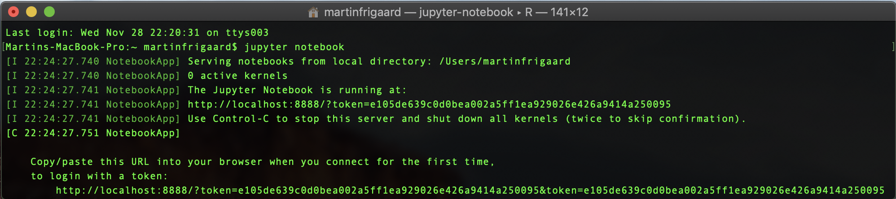
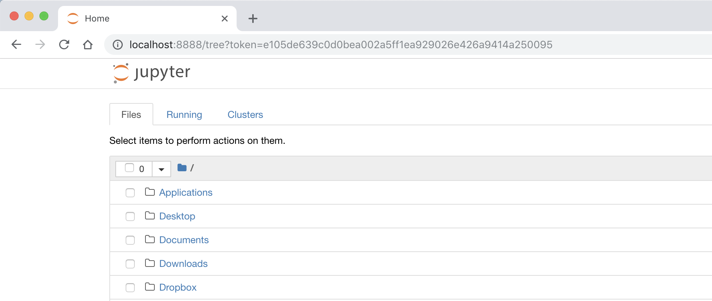
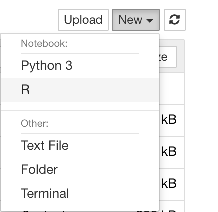
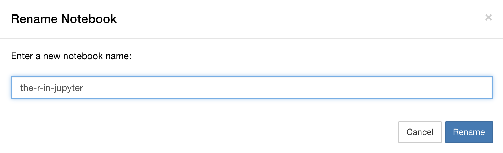
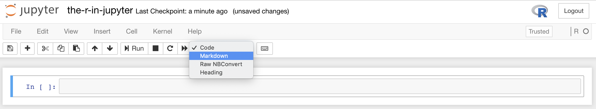
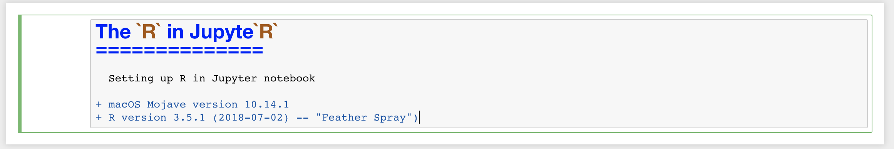
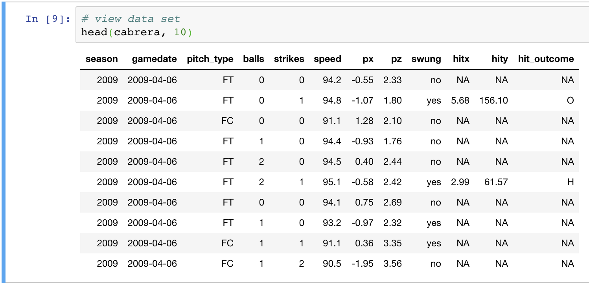
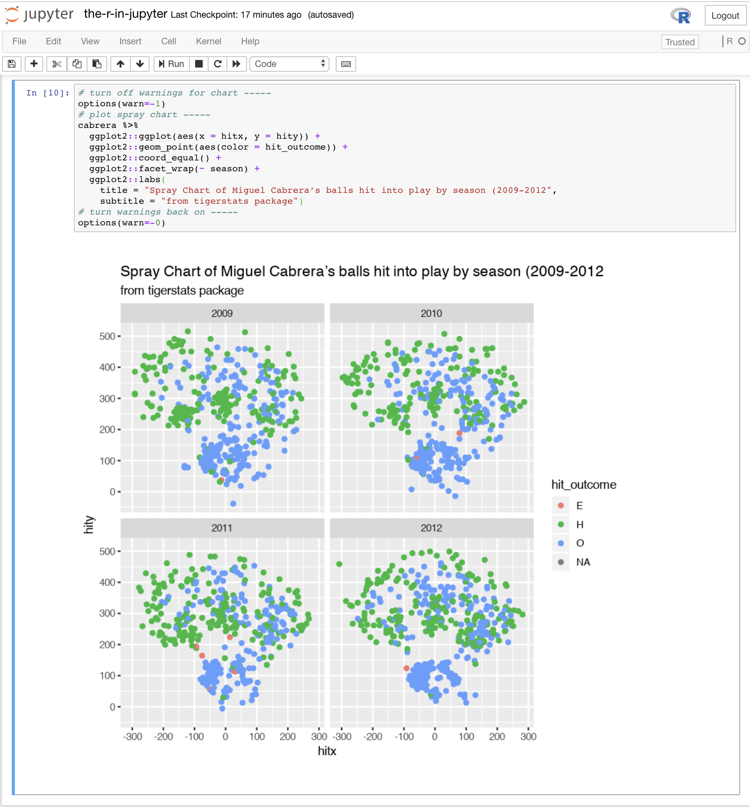

The `R` in Jupyte`R`
==============

## Setting up R in Jupyter notebook 

My system information:

+ macOS Mojave version 10.14.1
+ R version 3.5.1 (2018-07-02) -- "Feather Spray")

***

This post walks through how to install R on a Jupyter notebook. 

Start by installing python using [homebrew](https://brew.sh/).

## 1) Install `python`

Open Terminal and enter the following commands. 

```bash
$ brew install python
```

It should already be installed, in which case you'll need to `upgrade` 

```bash
$ brew upgrade python
```

## 2) Install `jupyter` 

Next install the `jupyter` notebook

```bash
$ brew install jupyter
```

## 3) Install `zmq`

```bash
$ brew install zmq
```

## 4) Install the following R packages 

These packages can be installed using R or RStudio. They are also found in the `jupyter-install-pkgs.R` file. 

```r
install.packages(c('rzmq','repr','IRkernel','IRdisplay'),
                 repos = c('http://irkernel.github.io/', 
                           getOption('repos')), 
                 type = 'source')
IRkernel::installspec(user = FALSE)
```

## 5) Launch jupyter notebooks

Open a new terminal window, enter the following commands.

```bash
$ jupyter notebook
```

This will launch the jupter notebook. You'll see this in your Terminal:



The jupyter notebook will open in the browser



Click on the **New** icon in the upper right corner of the jupyter notebook and select **R**. 



Click on the **Untitled** text next to the Jupyter on the top of the notebook and rename the file something meaningful. 



## 6) Using jupyter notebooks

The Jupyter notebooks combine code cells with markdown (just like RStudio Notebooks). I'll start this notebook with a markdown title cell.  



As you can see, this cell has markdown syntax highlighting. If I want to see how the cell will look after running it, hold down **control + return** (this is how to run a cell in Jupyter notebooks).



## 7) Run some R code

Enter the following code in the next cell and run it (either by using **control + return** or clicking **Run**)

```r
# run this in jupyter notebook --------------------------------------------
# install packages
suppressPackageStartupMessages(library(tidyverse))
suppressPackageStartupMessages(library(magrittr))
suppressPackageStartupMessages(library(mosaic))
suppressPackageStartupMessages(library(tigerstats))
```

Let's print a portion of a data frame to see what it looks like in Jupyter notebooks. 

```r
# get data set
cabrera <- tigerstats::cabrera
```



Tables look pretty in Jupyter! 

I'll see how a `ggplot2` visualization looks next.
Enter the following commands into the next code cell (*I turned off the warnings before and after the plot commands to get rid of all the excess output*).

```r
# turn off warnings for chart ----- 
options(warn=-1)
# plot spray chart
cabrera %>% 
  ggplot2::ggplot(aes(x = hitx, y = hity)) + 
  ggplot2::geom_point(aes(color = hit_outcome)) + 
  ggplot2::coord_equal() + 
  ggplot2::facet_wrap(~ season) +
  ggplot2::labs(
    title = "Spray Chart of Miguel Cabrera’s balls hit into play by season (2009-2012)",
    subtitle = "from tigerstats package")
# turn warnings back on -----
options(warn=-0)
```

The graph output is directly beneath the cell! Beautiful!



## 8) Download options

Under **File** > **Download as** I can see I have the option to save this file as a `.ipynb` (which is a JSON file), `.md`, `.r`, and many others. 

Happy coding!